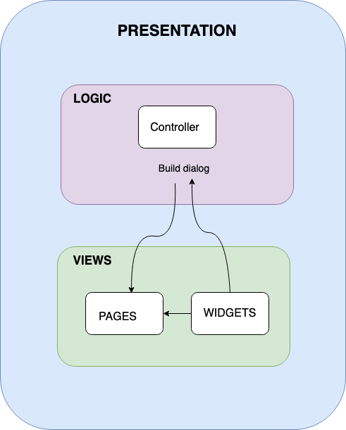

# flutter_getx_validation

Flutter getX
Go there to see more explanation about this project

https://www.marialijideveloper.com/2021/05/getx-extra-light-and-powerful-solution-for-flutter-it-combines-high-performance-state-management/
## Flutter packages
 - [get] 
 - [folding_cell]
 - [google_fonts]
